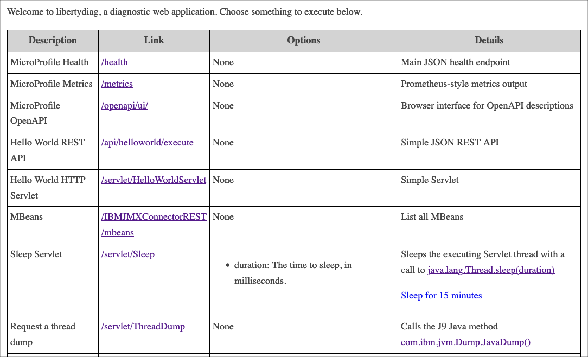

# libertydiag

`libertydiag` is a [Jakarta EE 9](https://openliberty.io/docs/latest/jakarta-ee.html) and [MicroProfile 5](https://openliberty.io/docs/latest/microprofile.html) web application for simulating diagnostic situations.

Running this application in production should be done with care because it may be used to execute various powerful functions.

## Download or Run

Download `libertydiag.war` from the latest release at <https://github.com/IBM/libertydiag/releases/latest>

This application [requires](https://www.ibm.com/docs/en/was-liberty/base?topic=management-liberty-features) Liberty >= 22.0.0.1 and the following features to be installed:

```
  <featureManager>
    <feature>jakartaee-9.1</feature>
    <feature>microProfile-5.0</feature>
  <featureManager>
```

The latest release is also built into an image at [quay.io/ibm/libertydiag](https://quay.io/repository/ibm/libertydiag); for example:

```
podman run --rm -p 9080:9080 -p 9443:9443 -it quay.io/ibm/libertydiag
```

Then access at <http://localhost:9080/> or <https://localhost:9443/>

## Screenshot



## Development

1. Java >= 8 is required on your `PATH`; for example, [Semeru Java 8](https://developer.ibm.com/languages/java/semeru-runtimes/downloads/?version=8)
1. Build and run with [`mvnw liberty:dev`](https://openliberty.io/docs/latest/development-mode.html):
    * macOS and Linux:
      ```
      ./mvnw liberty:dev
      ```
    * Windows:
      ```
      mvnw liberty:dev
      ```
1. Wait for the message, "server is ready to run a smarter planet". For example:
   ```
   [INFO] [AUDIT   ] CWWKF0011I: The defaultServer server is ready to run a smarter planet. The defaultServer server started in 30.292 seconds.
   ```
1. Open your browser to the HTTP or HTTPS page:
    * <http://localhost:9080/>
    * <https://localhost:9443/>

### Eclipse

To develop in Eclipse:

1. Install the Eclipse flavor: [Eclipse IDE for Enterprise Java and Web Developers](https://www.eclipse.org/downloads/packages/)
1. Start Eclipse and click File } Import... } Maven } Existing Maven Projects

### Notes

1. Example overriding variables: `mvnw -Dliberty.var.HTTP_PORT=9081 -Dliberty.var.HTTPS_PORT=9444 liberty:dev`
1. Build WAR file and Liberty package: `mvnw package`
1. Run Liberty in the console: `mvnw liberty:run`
1. If you'd like to run the Liberty package as a jar: `java -jar target/libertydiag.jar`
1. Build container with normal logging:
   ```
   mvnw -Dimage.builder.arguments="--build-arg WLP_LOGGING_CONSOLE_FORMAT='SIMPLE' --build-arg WLP_LOGGING_CONSOLE_LOGLEVEL='INFO' --build-arg WLP_LOGGING_CONSOLE_SOURCE='message'" deploy
   ```
1. Build container: `mvnw deploy`
1. Build container and push the manifest to [quay.io/ibm/libertydiag](https://quay.io/repository/ibm/libertydiag?tab=tags):
    1. `podman login quay.io`
    1. `mvnw -Dimage.manifest.repository.push=true deploy`

### Build Issues

1. Running `mvnw deploy` errors with `An Ant BuildException has occured: Execute failed: java.io.IOException: Cannot run program "podman"`
   \
   \
   If `podman` is not on your path and you want to use, for example, `docker` instead:
   ```
   mvnw -Dimage.builder=docker deploy
   ```
1. Running `mvnw deploy` errors with `An Ant BuildException has occured: exec returned:`
   \
   \
   Add `-X` to show full output:
   ```
   mvnw -X deploy
   ```

## New Release

1. Update the date in `pom.xml` in the line `<version>0.1.$DATE</version>` and then commit and push
    1. `git commit -a -s -S -m "Description of changes in this release"`
    1. `git push`
1. Confirm that the push built successfully: <https://github.com/IBM/libertydiag/actions>
1. Tag with the same version and push
    1. `git tag 0.1.$DATE`
    1. `git push --tags`
